# SpoolIQ Frontend Development Guide

## 📋 Visão Geral

Este documento fornece um guia completo para desenvolver o frontend da aplicação **SpoolIQ** - um sistema de gestão e cálculo de custos para impressão 3D. O sistema permite que usuários gerenciem filamentos, criem orçamentos detalhados e calculem custos precisos considerando materiais, energia, desgaste de equipamentos e mão de obra.

## 🎯 Objetivos do Sistema

- **Gestão de Filamentos**: Catálogo global e pessoal de filamentos para impressão 3D
- **Criação de Orçamentos**: Sistema completo de cotação com múltiplos perfis de custo
- **Cálculos Precisos**: Engine de cálculo considerando todos os fatores de custo
- **Exportação de Dados**: Relatórios em CSV, JSON e PDF
- **Gestão de Usuários**: Sistema multi-tenant com controle de acesso

## 🛠️ Stack Tecnológica Recomendada

### Core Technologies
- **React 18+** com TypeScript
- **Vite** como bundler e dev server
- **Tailwind CSS** para estilização
- **React Router v6** para roteamento

### State Management & Data Fetching
- **TanStack Query (React Query)** para cache e sincronização de dados
- **Zustand** ou **Redux Toolkit** para estado global
- **React Hook Form** com **Zod** para formulários e validação

### UI Components & Design
- **Headless UI** ou **Radix UI** para componentes acessíveis
- **Lucide React** para ícones
- **Recharts** ou **Chart.js** para gráficos
- **React Table** para tabelas complexas

### Utilities
- **Axios** para requisições HTTP
- **Date-fns** para manipulação de datas
- **React Hot Toast** para notificações
- **Framer Motion** para animações

---

## 🏗️ Estrutura do Projeto

```
src/
├── components/          # Componentes reutilizáveis
│   ├── ui/             # Componentes base (Button, Input, etc.)
│   ├── forms/          # Componentes de formulário
│   ├── tables/         # Componentes de tabela
│   └── charts/         # Componentes de gráficos
├── pages/              # Páginas da aplicação
│   ├── auth/           # Páginas de autenticação
│   ├── quotes/         # Páginas de orçamentos
│   ├── filaments/      # Páginas de filamentos
│   ├── users/          # Páginas de usuários (admin)
│   └── settings/       # Páginas de configurações
├── hooks/              # Custom hooks
├── services/           # Serviços de API
├── stores/             # Estado global
├── types/              # Definições TypeScript
├── utils/              # Utilitários
└── layouts/            # Layouts da aplicação
```

---

## 🔐 Sistema de Autenticação

### Fluxo de Autenticação

1. **Login/Registro**: Usuário autentica via `/auth/login` ou `/auth/register`
2. **Tokens JWT**: Sistema retorna access token e refresh token
3. **Interceptor**: Axios interceptor adiciona Bearer token automaticamente
4. **Refresh Automático**: Token é renovado automaticamente quando expira
5. **Logout**: Invalidação do refresh token via `/auth/logout`

### Implementação do AuthContext

```typescript
interface AuthContextType {
  user: User | null;
  login: (credentials: LoginRequest) => Promise<void>;
  logout: () => void;
  register: (data: RegisterRequest) => Promise<void>;
  isLoading: boolean;
  isAuthenticated: boolean;
}

const AuthContext = createContext<AuthContextType | null>(null);

export const useAuth = () => {
  const context = useContext(AuthContext);
  if (!context) {
    throw new Error('useAuth must be used within an AuthProvider');
  }
  return context;
};
```

### Protected Routes

```typescript
const ProtectedRoute = ({ children, requiredRole }: ProtectedRouteProps) => {
  const { isAuthenticated, user } = useAuth();

  if (!isAuthenticated) {
    return <Navigate to="/login" replace />;
  }

  if (requiredRole && !user?.roles.includes(requiredRole)) {
    return <Navigate to="/unauthorized" replace />;
  }

  return children;
};
```

---

## 📊 Gerenciamento de Estado

### Estrutura do Estado Global

```typescript
interface AppState {
  // Auth State
  auth: {
    user: User | null;
    tokens: TokenPair | null;
    isAuthenticated: boolean;
  };

  // UI State
  ui: {
    theme: 'light' | 'dark';
    sidebarOpen: boolean;
    notifications: Notification[];
  };

  // App State
  quotes: {
    currentQuote: Quote | null;
    filters: QuoteFilters;
  };
}
```

### React Query Setup

```typescript
const queryClient = new QueryClient({
  defaultOptions: {
    queries: {
      staleTime: 5 * 60 * 1000, // 5 minutos
      refetchOnWindowFocus: false,
    },
  },
});

// Query Keys
export const queryKeys = {
  quotes: ['quotes'] as const,
  quote: (id: string) => ['quotes', id] as const,
  filaments: ['filaments'] as const,
  users: ['users'] as const,
  presets: {
    energy: ['presets', 'energy'] as const,
    machines: ['presets', 'machines'] as const,
  },
};
```

---

## 🌐 Serviços de API

### Base API Client

```typescript
class ApiClient {
  private client: AxiosInstance;

  constructor() {
    this.client = axios.create({
      baseURL: import.meta.env.VITE_API_URL,
      timeout: 10000,
    });

    this.setupInterceptors();
  }

  private setupInterceptors() {
    // Request interceptor para adicionar auth token
    this.client.interceptors.request.use(
      (config) => {
        const token = localStorage.getItem('accessToken');
        if (token) {
          config.headers.Authorization = `Bearer ${token}`;
        }
        return config;
      },
      (error) => Promise.reject(error)
    );

    // Response interceptor para handle de erros e refresh token
    this.client.interceptors.response.use(
      (response) => response,
      async (error) => {
        if (error.response?.status === 401) {
          await this.refreshToken();
          return this.client(error.config);
        }
        return Promise.reject(error);
      }
    );
  }
}
```

### Serviços Específicos

```typescript
// services/quotes.service.ts
export class QuotesService {
  static async getQuotes(): Promise<Quote[]> {
    const response = await apiClient.get('/v1/quotes');
    return response.data.quotes;
  }

  static async createQuote(data: CreateQuoteRequest): Promise<Quote> {
    const response = await apiClient.post('/v1/quotes', data);
    return response.data;
  }

  static async calculateQuote(
    id: string,
    params: CalculateQuoteRequest
  ): Promise<CalculationResult> {
    const response = await apiClient.post(`/v1/quotes/${id}/calculate`, params);
    return response.data;
  }
}

// Custom hooks para quotes
export const useQuotes = () => {
  return useQuery({
    queryKey: queryKeys.quotes,
    queryFn: QuotesService.getQuotes,
  });
};

export const useCreateQuote = () => {
  const queryClient = useQueryClient();

  return useMutation({
    mutationFn: QuotesService.createQuote,
    onSuccess: () => {
      queryClient.invalidateQueries({ queryKey: queryKeys.quotes });
      toast.success('Orçamento criado com sucesso!');
    },
    onError: (error) => {
      toast.error('Erro ao criar orçamento');
    },
  });
};
```

---

## 📄 Páginas e Componentes Principais

### 1. Dashboard

**Funcionalidades:**
- Visão geral dos orçamentos recentes
- Estatísticas de custos e margens
- Gráficos de desempenho
- Links rápidos para ações principais

**Componentes:**
```typescript
const Dashboard = () => {
  const { data: quotes } = useQuotes();
  const { data: stats } = useQuoteStats();

  return (
    <div className="space-y-6">
      <StatsCards stats={stats} />
      <RecentQuotesTable quotes={quotes?.slice(0, 5)} />
      <ChartsSection data={stats} />
    </div>
  );
};
```

### 2. Gestão de Orçamentos

#### 2.1 Lista de Orçamentos

**Funcionalidades:**
- Tabela paginada com busca e filtros
- Ações: visualizar, editar, duplicar, calcular, exportar, deletar
- Filtros por data, status, valor

```typescript
const QuotesListPage = () => {
  const [filters, setFilters] = useState<QuoteFilters>({
    search: '',
    dateRange: null,
    sortBy: 'created_at',
    sortOrder: 'desc',
  });

  const { data, isLoading } = useQuotes(filters);

  return (
    <div className="space-y-6">
      <PageHeader title="Orçamentos" />
      <QuotesFilters filters={filters} onChange={setFilters} />
      <QuotesTable
        data={data?.quotes || []}
        isLoading={isLoading}
        onAction={handleQuoteAction}
      />
    </div>
  );
};
```

#### 2.2 Criação/Edição de Orçamento

**Funcionalidades:**
- Formulário multi-step com validação
- Seleção de filamentos com busca
- Configuração de perfis de custo
- Preview em tempo real

```typescript
const CreateQuotePage = () => {
  const navigate = useNavigate();
  const { mutate: createQuote } = useCreateQuote();

  const form = useForm<CreateQuoteRequest>({
    resolver: zodResolver(createQuoteSchema),
    defaultValues: {
      title: '',
      notes: '',
      filament_lines: [],
      cost_profile: { overhead_amount: 0, wear_percentage: 0 },
      energy_profile: { base_tariff: 0, flag_surcharge: 0, location: '', year: new Date().getFullYear() },
      machine_profile: { name: '', brand: '', model: '', watt: 0, idle_factor: 0 },
      margin_profile: {
        printing_only_margin: 0,
        printing_plus_margin: 0,
        full_service_margin: 0,
        operator_rate_per_hour: 0,
        modeler_rate_per_hour: 0,
      },
    },
  });

  return (
    <Form {...form}>
      <div className="max-w-4xl mx-auto space-y-8">
        <QuoteBasicInfoStep />
        <FilamentLinesStep />
        <CostProfileStep />
        <EnergyProfileStep />
        <MachineProfileStep />
        <MarginProfileStep />
        <QuotePreview />
      </div>
    </Form>
  );
};
```

#### 2.3 Calculadora de Orçamento

**Funcionalidades:**
- Interface para inserir parâmetros de impressão
- Cálculo em tempo real
- Breakdown detalhado de custos
- Comparação entre tipos de serviço

```typescript
const QuoteCalculatorPage = () => {
  const { id } = useParams();
  const { data: quote } = useQuote(id!);
  const [params, setParams] = useState<CalculateQuoteRequest>({
    print_time_hours: 0,
    service_type: 'printing_only',
    operator_minutes: 0,
    modeler_minutes: 0,
  });

  const { data: calculation, mutate: calculate } = useCalculateQuote();

  useEffect(() => {
    if (params.print_time_hours > 0) {
      calculate({ id: id!, params });
    }
  }, [params]);

  return (
    <div className="grid grid-cols-1 lg:grid-cols-2 gap-8">
      <CalculationForm params={params} onChange={setParams} />
      <CalculationResults
        quote={quote}
        calculation={calculation}
        params={params}
      />
    </div>
  );
};
```

### 3. Gestão de Filamentos

#### 3.1 Catálogo de Filamentos

**Funcionalidades:**
- Grid responsivo com cards de filamentos
- Filtros por material, marca, cor
- Diferenciação entre filamentos globais e pessoais
- Ações: criar, editar, deletar (apenas próprios)

```typescript
const FilamentsPage = () => {
  const [view, setView] = useState<'all' | 'global' | 'my'>('all');
  const [filters, setFilters] = useState<FilamentFilters>({});

  const { data: filaments } = useFilaments(view, filters);

  return (
    <div className="space-y-6">
      <div className="flex justify-between items-center">
        <PageHeader title="Filamentos" />
        <Button onClick={() => setCreateModalOpen(true)}>
          <Plus className="w-4 h-4 mr-2" />
          Novo Filamento
        </Button>
      </div>

      <FilamentFilters
        filters={filters}
        onChange={setFilters}
        view={view}
        onViewChange={setView}
      />

      <FilamentGrid filaments={filaments} />
    </div>
  );
};
```

### 4. Gestão de Usuários (Admin)

**Funcionalidades:**
- Lista paginada de usuários
- Criação e edição de usuários
- Gestão de permissões e status
- Reset de senhas

```typescript
const UsersManagementPage = () => {
  const { data: users, isLoading } = useUsers();
  const { mutate: createUser } = useCreateUser();
  const { mutate: updateUser } = useUpdateUser();

  return (
    <div className="space-y-6">
      <PageHeader title="Gestão de Usuários" />
      <UsersTable
        users={users?.users || []}
        isLoading={isLoading}
        onEdit={handleEditUser}
        onDelete={handleDeleteUser}
        onToggleStatus={handleToggleStatus}
      />
    </div>
  );
};
```

---

## 🎨 Design System Baseado no Airbnb

### Sistema de Cores e Temas

Inspirado no design system do Airbnb com suporte completo a modo claro e escuro:

```typescript
// tailwind.config.js
module.exports = {
  darkMode: 'class',
  theme: {
    extend: {
      colors: {
        // Airbnb-inspired Brand Colors
        brand: {
          // Celosia Orange (Airbnb Red adaptado)
          50: '#fef7f0',
          100: '#feede1',
          200: '#fcd9c2',
          300: '#f9bd9e',
          400: '#f59e6f',
          500: '#FF5A5F', // Primary brand color
          600: '#e8484d',
          700: '#d63641',
          800: '#b02d37',
          900: '#8f252d',
        },
        // Rausch (Airbnb secondary)
        secondary: {
          50: '#fef1f7',
          100: '#fee5f0',
          200: '#fecce3',
          300: '#fda4cc',
          400: '#fb6fa8',
          500: '#FF5A87',
          600: '#f13d6b',
          700: '#d42652',
          800: '#b02246',
          900: '#93203e',
        },
        // Kazan (Teal for accents)
        accent: {
          50: '#f0fdfa',
          100: '#ccfbf1',
          200: '#99f6e4',
          300: '#5eead4',
          400: '#2dd4bf',
          500: '#00A699', // Airbnb teal
          600: '#0d9488',
          700: '#0f766e',
          800: '#115e59',
          900: '#134e4a',
        },
        // Neutral Grays (Airbnb style)
        gray: {
          25: '#fcfcfc',
          50: '#f7f7f7',
          100: '#ebebeb',
          200: '#d1d1d1',
          300: '#b0b0b0',
          400: '#909090',
          500: '#6a6a6a',
          600: '#5d5d5d',
          700: '#4f4f4f',
          800: '#454545',
          900: '#3a3a3a',
          950: '#262626',
        },
        // Status Colors
        success: {
          50: '#f0fdf4',
          100: '#dcfce7',
          200: '#bbf7d0',
          300: '#86efac',
          400: '#4ade80',
          500: '#22c55e',
          600: '#16a34a',
          700: '#15803d',
          800: '#166534',
          900: '#14532d',
        },
        warning: {
          50: '#fffbeb',
          100: '#fef3c7',
          200: '#fde68a',
          300: '#fcd34d',
          400: '#fbbf24',
          500: '#f59e0b',
          600: '#d97706',
          700: '#b45309',
          800: '#92400e',
          900: '#78350f',
        },
        error: {
          50: '#fef2f2',
          100: '#fee2e2',
          200: '#fecaca',
          300: '#fca5a5',
          400: '#f87171',
          500: '#ef4444',
          600: '#dc2626',
          700: '#b91c1c',
          800: '#991b1b',
          900: '#7f1d1d',
        },
        // Theme-specific colors
        background: {
          light: '#ffffff',
          dark: '#0f0f0f',
        },
        surface: {
          light: '#ffffff',
          dark: '#1a1a1a',
        },
        'surface-secondary': {
          light: '#f7f7f7',
          dark: '#262626',
        },
      },
      fontFamily: {
        sans: ['Circular', 'system-ui', 'sans-serif'],
        mono: ['Circular Mono', 'monospace'],
      },
      fontSize: {
        '2xs': ['0.625rem', { lineHeight: '0.75rem' }],
        xs: ['0.75rem', { lineHeight: '1rem' }],
        sm: ['0.875rem', { lineHeight: '1.25rem' }],
        base: ['1rem', { lineHeight: '1.5rem' }],
        lg: ['1.125rem', { lineHeight: '1.75rem' }],
        xl: ['1.25rem', { lineHeight: '1.75rem' }],
        '2xl': ['1.5rem', { lineHeight: '2rem' }],
        '3xl': ['1.875rem', { lineHeight: '2.25rem' }],
        '4xl': ['2.25rem', { lineHeight: '2.5rem' }],
        '5xl': ['3rem', { lineHeight: '1' }],
      },
      borderRadius: {
        'airbnb': '12px',
        'airbnb-lg': '16px',
        'airbnb-xl': '24px',
      },
      boxShadow: {
        'airbnb': '0 2px 4px rgba(0,0,0,0.18)',
        'airbnb-md': '0 6px 16px rgba(0,0,0,0.12)',
        'airbnb-lg': '0 8px 28px rgba(0,0,0,0.28)',
        'airbnb-xl': '0 20px 40px rgba(0,0,0,0.15)',
      },
    },
  },
};
```

### Theme Provider e Context

```typescript
// contexts/ThemeContext.tsx
type Theme = 'light' | 'dark' | 'system';

interface ThemeContextType {
  theme: Theme;
  resolvedTheme: 'light' | 'dark';
  setTheme: (theme: Theme) => void;
  toggleTheme: () => void;
}

const ThemeContext = createContext<ThemeContextType | null>(null);

export const ThemeProvider = ({ children }: { children: React.ReactNode }) => {
  const [theme, setTheme] = useState<Theme>(() => {
    return (localStorage.getItem('theme') as Theme) || 'system';
  });

  const [resolvedTheme, setResolvedTheme] = useState<'light' | 'dark'>('light');

  useEffect(() => {
    const updateTheme = () => {
      if (theme === 'system') {
        const systemTheme = window.matchMedia('(prefers-color-scheme: dark)').matches ? 'dark' : 'light';
        setResolvedTheme(systemTheme);
      } else {
        setResolvedTheme(theme);
      }
    };

    updateTheme();

    if (theme === 'system') {
      const mediaQuery = window.matchMedia('(prefers-color-scheme: dark)');
      mediaQuery.addEventListener('change', updateTheme);
      return () => mediaQuery.removeEventListener('change', updateTheme);
    }
  }, [theme]);

  useEffect(() => {
    document.documentElement.classList.toggle('dark', resolvedTheme === 'dark');
    localStorage.setItem('theme', theme);
  }, [theme, resolvedTheme]);

  const toggleTheme = () => {
    setTheme(prev => prev === 'light' ? 'dark' : 'light');
  };

  return (
    <ThemeContext.Provider value={{ theme, resolvedTheme, setTheme, toggleTheme }}>
      {children}
    </ThemeContext.Provider>
  );
};

export const useTheme = () => {
  const context = useContext(ThemeContext);
  if (!context) throw new Error('useTheme must be used within ThemeProvider');
  return context;
};
```

### Componentes Base Estilo Airbnb

```typescript
// components/ui/Button.tsx
interface ButtonProps extends React.ButtonHTMLAttributes<HTMLButtonElement> {
  variant?: 'primary' | 'secondary' | 'outline' | 'ghost' | 'danger' | 'minimal';
  size?: 'xs' | 'sm' | 'md' | 'lg' | 'xl';
  isLoading?: boolean;
  fullWidth?: boolean;
}

export const Button = ({
  variant = 'primary',
  size = 'md',
  isLoading,
  fullWidth,
  children,
  className,
  ...props
}: ButtonProps) => {
  const baseClasses = cn(
    // Base styles inspired by Airbnb
    'inline-flex items-center justify-center font-medium transition-all duration-200',
    'focus:outline-none focus:ring-2 focus:ring-offset-2 focus:ring-brand-500',
    'disabled:opacity-50 disabled:cursor-not-allowed',
    'dark:focus:ring-offset-gray-800',
    {
      'w-full': fullWidth,
    }
  );

  const variants = {
    primary: cn(
      'bg-gradient-to-r from-brand-500 to-brand-600 text-white shadow-airbnb',
      'hover:from-brand-600 hover:to-brand-700 hover:shadow-airbnb-md',
      'active:from-brand-700 active:to-brand-800 active:shadow-airbnb',
      'dark:shadow-gray-900/20'
    ),
    secondary: cn(
      'bg-white text-gray-700 border border-gray-300 shadow-airbnb',
      'hover:bg-gray-50 hover:border-gray-400 hover:shadow-airbnb-md',
      'active:bg-gray-100',
      'dark:bg-gray-800 dark:text-gray-200 dark:border-gray-600',
      'dark:hover:bg-gray-700 dark:hover:border-gray-500'
    ),
    outline: cn(
      'border-2 border-brand-500 text-brand-600 bg-transparent',
      'hover:bg-brand-50 hover:border-brand-600',
      'active:bg-brand-100',
      'dark:text-brand-400 dark:border-brand-400',
      'dark:hover:bg-brand-900/20 dark:hover:border-brand-300'
    ),
    ghost: cn(
      'text-gray-700 bg-transparent',
      'hover:bg-gray-100 hover:text-gray-900',
      'active:bg-gray-200',
      'dark:text-gray-300 dark:hover:bg-gray-800 dark:hover:text-gray-100'
    ),
    danger: cn(
      'bg-error-500 text-white shadow-airbnb',
      'hover:bg-error-600 hover:shadow-airbnb-md',
      'active:bg-error-700',
      'focus:ring-error-500'
    ),
    minimal: cn(
      'text-brand-600 bg-transparent p-0 shadow-none',
      'hover:text-brand-700 hover:underline',
      'dark:text-brand-400 dark:hover:text-brand-300'
    ),
  };

  const sizes = {
    xs: 'px-2.5 py-1.5 text-xs rounded-lg',
    sm: 'px-3 py-2 text-sm rounded-airbnb',
    md: 'px-4 py-2.5 text-sm rounded-airbnb',
    lg: 'px-6 py-3 text-base rounded-airbnb-lg',
    xl: 'px-8 py-4 text-lg rounded-airbnb-lg',
  };

  return (
    <button
      className={cn(baseClasses, variants[variant], sizes[size], className)}
      disabled={isLoading || props.disabled}
      {...props}
    >
      {isLoading && (
        <Loader2 className="w-4 h-4 mr-2 animate-spin" />
      )}
      {children}
    </button>
  );
};
```

### Componente de Card Estilo Airbnb

```typescript
// components/ui/Card.tsx
interface CardProps extends React.HTMLAttributes<HTMLDivElement> {
  variant?: 'default' | 'elevated' | 'outlined';
  padding?: 'none' | 'sm' | 'md' | 'lg' | 'xl';
  hover?: boolean;
}

export const Card = ({
  variant = 'default',
  padding = 'md',
  hover = false,
  className,
  children,
  ...props
}: CardProps) => {
  const baseClasses = cn(
    'bg-white rounded-airbnb-lg border transition-all duration-200',
    'dark:bg-surface-dark dark:border-gray-700',
    {
      'hover:shadow-airbnb-lg hover:-translate-y-1': hover,
      'cursor-pointer': hover,
    }
  );

  const variants = {
    default: cn(
      'border-gray-200 shadow-airbnb',
      'dark:shadow-gray-900/20'
    ),
    elevated: cn(
      'border-transparent shadow-airbnb-md',
      'dark:shadow-gray-900/40'
    ),
    outlined: cn(
      'border-gray-300 shadow-none',
      'dark:border-gray-600'
    ),
  };

  const paddings = {
    none: '',
    sm: 'p-4',
    md: 'p-6',
    lg: 'p-8',
    xl: 'p-10',
  };

  return (
    <div
      className={cn(baseClasses, variants[variant], paddings[padding], className)}
      {...props}
    >
      {children}
    </div>
  );
};
```

### Input Components Estilo Airbnb

```typescript
// components/ui/Input.tsx
interface InputProps extends React.InputHTMLAttributes<HTMLInputElement> {
  label?: string;
  error?: string;
  helper?: string;
  startIcon?: React.ReactNode;
  endIcon?: React.ReactNode;
  fullWidth?: boolean;
}

export const Input = forwardRef<HTMLInputElement, InputProps>(({
  label,
  error,
  helper,
  startIcon,
  endIcon,
  fullWidth,
  className,
  ...props
}, ref) => {
  const inputId = useId();

  return (
    <div className={cn('space-y-1', { 'w-full': fullWidth })}>
      {label && (
        <label
          htmlFor={inputId}
          className="block text-sm font-medium text-gray-700 dark:text-gray-300"
        >
          {label}
        </label>
      )}

      <div className="relative">
        {startIcon && (
          <div className="absolute inset-y-0 left-0 pl-3 flex items-center pointer-events-none">
            <div className="text-gray-400 dark:text-gray-500">
              {startIcon}
            </div>
          </div>
        )}

        <input
          ref={ref}
          id={inputId}
          className={cn(
            // Airbnb-style input
            'block w-full px-4 py-3 border border-gray-300 rounded-airbnb',
            'bg-white text-gray-900 placeholder:text-gray-400',
            'focus:outline-none focus:ring-2 focus:ring-brand-500 focus:border-transparent',
            'transition-all duration-200',
            // Dark mode
            'dark:bg-gray-800 dark:border-gray-600 dark:text-gray-100',
            'dark:placeholder:text-gray-500 dark:focus:ring-brand-400',
            // Icon padding
            {
              'pl-10': startIcon,
              'pr-10': endIcon,
            },
            // Error state
            error && [
              'border-error-300 focus:ring-error-500 focus:border-error-500',
              'dark:border-error-400'
            ],
            className
          )}
          {...props}
        />

        {endIcon && (
          <div className="absolute inset-y-0 right-0 pr-3 flex items-center">
            <div className="text-gray-400 dark:text-gray-500">
              {endIcon}
            </div>
          </div>
        )}
      </div>

      {(error || helper) && (
        <div className="mt-1">
          {error && (
            <p className="text-sm text-error-500 dark:text-error-400">
              {error}
            </p>
          )}
          {helper && !error && (
            <p className="text-sm text-gray-500 dark:text-gray-400">
              {helper}
            </p>
          )}
        </div>
      )}
    </div>
  );
});
```

### Theme Switcher Component

```typescript
// components/ui/ThemeSwitcher.tsx
export const ThemeSwitcher = () => {
  const { theme, setTheme } = useTheme();

  const themes = [
    { value: 'light', label: 'Claro', icon: Sun },
    { value: 'dark', label: 'Escuro', icon: Moon },
    { value: 'system', label: 'Sistema', icon: Monitor },
  ] as const;

  return (
    <div className="relative">
      <Listbox value={theme} onChange={setTheme}>
        <Listbox.Button className="relative w-full cursor-default rounded-airbnb bg-white py-2 pl-3 pr-10 text-left shadow-airbnb focus:outline-none focus:ring-2 focus:ring-brand-500 dark:bg-gray-800 dark:text-gray-100">
          <span className="flex items-center">
            {(() => {
              const currentTheme = themes.find(t => t.value === theme);
              const Icon = currentTheme?.icon || Monitor;
              return (
                <>
                  <Icon className="h-4 w-4 mr-2" />
                  {currentTheme?.label}
                </>
              );
            })()}
          </span>
          <span className="pointer-events-none absolute inset-y-0 right-0 flex items-center pr-2">
            <ChevronDown className="h-4 w-4 text-gray-400" />
          </span>
        </Listbox.Button>

        <Transition
          as={Fragment}
          enter="transition ease-out duration-100"
          enterFrom="transform opacity-0 scale-95"
          enterTo="transform opacity-100 scale-100"
          leave="transition ease-in duration-75"
          leaveFrom="transform opacity-100 scale-100"
          leaveTo="transform opacity-0 scale-95"
        >
          <Listbox.Options className="absolute right-0 z-10 mt-1 max-h-60 w-48 overflow-auto rounded-airbnb bg-white py-1 shadow-airbnb-lg ring-1 ring-black ring-opacity-5 focus:outline-none dark:bg-gray-800 dark:ring-gray-700">
            {themes.map((themeOption) => {
              const Icon = themeOption.icon;
              return (
                <Listbox.Option
                  key={themeOption.value}
                  className={({ active }) =>
                    cn(
                      'relative cursor-default select-none py-2 pl-3 pr-9',
                      active
                        ? 'bg-brand-50 text-brand-900 dark:bg-brand-900 dark:text-brand-100'
                        : 'text-gray-900 dark:text-gray-100'
                    )
                  }
                  value={themeOption.value}
                >
                  {({ selected }) => (
                    <>
                      <div className="flex items-center">
                        <Icon className="h-4 w-4 mr-2" />
                        <span className={cn('block truncate', selected ? 'font-medium' : 'font-normal')}>
                          {themeOption.label}
                        </span>
                      </div>
                      {selected && (
                        <span className="absolute inset-y-0 right-0 flex items-center pr-4 text-brand-600 dark:text-brand-400">
                          <Check className="h-4 w-4" />
                        </span>
                      )}
                    </>
                  )}
                </Listbox.Option>
              );
            })}
          </Listbox.Options>
        </Transition>
      </Listbox>
    </div>
  );
};
```

### Avatar Component Estilo Airbnb

```typescript
// components/ui/Avatar.tsx
interface AvatarProps {
  src?: string;
  alt?: string;
  name?: string;
  size?: 'xs' | 'sm' | 'md' | 'lg' | 'xl' | '2xl';
  fallback?: React.ReactNode;
  status?: 'online' | 'offline' | 'away' | 'busy';
}

export const Avatar = ({
  src,
  alt,
  name,
  size = 'md',
  fallback,
  status,
}: AvatarProps) => {
  const sizeClasses = {
    xs: 'w-6 h-6 text-xs',
    sm: 'w-8 h-8 text-sm',
    md: 'w-10 h-10 text-base',
    lg: 'w-12 h-12 text-lg',
    xl: 'w-16 h-16 text-xl',
    '2xl': 'w-20 h-20 text-2xl',
  };

  const statusColors = {
    online: 'bg-success-500',
    offline: 'bg-gray-400',
    away: 'bg-warning-500',
    busy: 'bg-error-500',
  };

  const getInitials = (name: string) => {
    return name
      .split(' ')
      .map(word => word[0])
      .join('')
      .toUpperCase()
      .slice(0, 2);
  };

  return (
    <div className="relative inline-block">
      <div
        className={cn(
          'rounded-full overflow-hidden bg-gray-200 flex items-center justify-center',
          'dark:bg-gray-700',
          sizeClasses[size]
        )}
      >
        {src ? (
          
        ) : fallback ? (
          fallback
        ) : name ? (
          <span className="font-medium text-gray-600 dark:text-gray-300">
            {getInitials(name)}
          </span>
        ) : (
          <User className="w-1/2 h-1/2 text-gray-400 dark:text-gray-500" />
        )}
      </div>

      {status && (
        <div
          className={cn(
            'absolute bottom-0 right-0 rounded-full border-2 border-white dark:border-gray-800',
            statusColors[status],
            {
              'w-2 h-2': size === 'xs' || size === 'sm',
              'w-3 h-3': size === 'md' || size === 'lg',
              'w-4 h-4': size === 'xl' || size === '2xl',
            }
          )}
        />
      )}
    </div>
  );
};
```

### Badge Component Estilo Airbnb

```typescript
// components/ui/Badge.tsx
interface BadgeProps {
  children: React.ReactNode;
  variant?: 'default' | 'brand' | 'success' | 'warning' | 'error' | 'secondary';
  size?: 'sm' | 'md' | 'lg';
  dot?: boolean;
  className?: string;
}

export const Badge = ({
  children,
  variant = 'default',
  size = 'md',
  dot = false,
  className,
}: BadgeProps) => {
  const baseClasses = cn(
    'inline-flex items-center font-medium rounded-full',
    'transition-colors duration-200'
  );

  const variants = {
    default: 'bg-gray-100 text-gray-800 dark:bg-gray-800 dark:text-gray-200',
    brand: 'bg-brand-100 text-brand-800 dark:bg-brand-900 dark:text-brand-200',
    success: 'bg-success-100 text-success-800 dark:bg-success-900 dark:text-success-200',
    warning: 'bg-warning-100 text-warning-800 dark:bg-warning-900 dark:text-warning-200',
    error: 'bg-error-100 text-error-800 dark:bg-error-900 dark:text-error-200',
    secondary: 'bg-gray-50 text-gray-600 border border-gray-200 dark:bg-gray-700 dark:text-gray-300 dark:border-gray-600',
  };

  const sizes = {
    sm: dot ? 'px-1.5 py-0.5 text-xs' : 'px-2 py-1 text-xs',
    md: dot ? 'px-2 py-1 text-sm' : 'px-2.5 py-1.5 text-sm',
    lg: dot ? 'px-2.5 py-1.5 text-base' : 'px-3 py-2 text-base',
  };

  return (
    <span className={cn(baseClasses, variants[variant], sizes[size], className)}>
      {dot && (
        <div className="w-2 h-2 bg-current rounded-full mr-1.5" />
      )}
      {children}
    </span>
  );
};
```

### Modal Component Estilo Airbnb

```typescript
// components/ui/Modal.tsx
interface ModalProps {
  isOpen: boolean;
  onClose: () => void;
  title?: string;
  children: React.ReactNode;
  size?: 'sm' | 'md' | 'lg' | 'xl' | 'full';
  showCloseButton?: boolean;
}

export const Modal = ({
  isOpen,
  onClose,
  title,
  children,
  size = 'md',
  showCloseButton = true,
}: ModalProps) => {
  const sizeClasses = {
    sm: 'max-w-md',
    md: 'max-w-lg',
    lg: 'max-w-2xl',
    xl: 'max-w-4xl',
    full: 'max-w-7xl mx-4',
  };

  return (
    <Transition appear show={isOpen} as={Fragment}>
      <Dialog as="div" className="relative z-50" onClose={onClose}>
        <Transition.Child
          as={Fragment}
          enter="ease-out duration-300"
          enterFrom="opacity-0"
          enterTo="opacity-100"
          leave="ease-in duration-200"
          leaveFrom="opacity-100"
          leaveTo="opacity-0"
        >
          <div className="fixed inset-0 bg-black bg-opacity-50 dark:bg-opacity-70" />
        </Transition.Child>

        <div className="fixed inset-0 overflow-y-auto">
          <div className="flex min-h-full items-center justify-center p-4 text-center">
            <Transition.Child
              as={Fragment}
              enter="ease-out duration-300"
              enterFrom="opacity-0 scale-95"
              enterTo="opacity-100 scale-100"
              leave="ease-in duration-200"
              leaveFrom="opacity-100 scale-100"
              leaveTo="opacity-0 scale-95"
            >
              <Dialog.Panel
                className={cn(
                  'w-full transform overflow-hidden rounded-airbnb-lg bg-white text-left align-middle shadow-airbnb-xl transition-all',
                  'dark:bg-gray-900',
                  sizeClasses[size]
                )}
              >
                {(title || showCloseButton) && (
                  <div className="flex items-center justify-between p-6 pb-4">
                    {title && (
                      <Dialog.Title
                        as="h3"
                        className="text-lg font-semibold leading-6 text-gray-900 dark:text-gray-100"
                      >
                        {title}
                      </Dialog.Title>
                    )}
                    {showCloseButton && (
                      <button
                        type="button"
                        className="rounded-full p-1 text-gray-400 hover:text-gray-500 hover:bg-gray-100 dark:hover:bg-gray-800 transition-colors"
                        onClick={onClose}
                      >
                        <X className="h-5 w-5" />
                      </button>
                    )}
                  </div>
                )}

                <div className={cn('px-6', title || showCloseButton ? 'pb-6' : 'py-6')}>
                  {children}
                </div>
              </Dialog.Panel>
            </Transition.Child>
          </div>
        </div>
      </Dialog>
    </Transition>
  );
};
```

### Layout Responsivo Estilo Airbnb

```typescript
// layouts/AppLayout.tsx
export const AppLayout = () => {
  const [sidebarOpen, setSidebarOpen] = useState(false);
  const { resolvedTheme } = useTheme();

  return (
    <div className={cn(
      'min-h-screen bg-gray-50 transition-colors duration-200',
      'dark:bg-gray-900'
    )}>
      {/* Sidebar para Mobile */}
      <Transition.Root show={sidebarOpen} as={Fragment}>
        <Dialog as="div" className="relative z-50 lg:hidden" onClose={setSidebarOpen}>
          <Transition.Child
            as={Fragment}
            enter="transition-opacity ease-linear duration-300"
            enterFrom="opacity-0"
            enterTo="opacity-100"
            leave="transition-opacity ease-linear duration-300"
            leaveFrom="opacity-100"
            leaveTo="opacity-0"
          >
            <div className="fixed inset-0 bg-gray-900/80" />
          </Transition.Child>

          <div className="fixed inset-0 flex">
            <Transition.Child
              as={Fragment}
              enter="transition ease-in-out duration-300 transform"
              enterFrom="-translate-x-full"
              enterTo="translate-x-0"
              leave="transition ease-in-out duration-300 transform"
              leaveFrom="translate-x-0"
              leaveTo="-translate-x-full"
            >
              <Dialog.Panel className="relative mr-16 flex w-full max-w-xs flex-1">
                <Transition.Child
                  as={Fragment}
                  enter="ease-in-out duration-300"
                  enterFrom="opacity-0"
                  enterTo="opacity-100"
                  leave="ease-in-out duration-300"
                  leaveFrom="opacity-100"
                  leaveTo="opacity-0"
                >
                  <div className="absolute left-full top-0 flex w-16 justify-center pt-5">
                    <button
                      type="button"
                      className="-m-2.5 p-2.5"
                      onClick={() => setSidebarOpen(false)}
                    >
                      <X className="h-6 w-6 text-white" />
                    </button>
                  </div>
                </Transition.Child>

                <div className="flex grow flex-col gap-y-5 overflow-y-auto bg-white px-6 pb-4 ring-1 ring-white/10 dark:bg-gray-900">
                  <div className="flex h-16 shrink-0 items-center">
                    
                  </div>
                  <Sidebar />
                </div>
              </Dialog.Panel>
            </Transition.Child>
          </div>
        </Dialog>
      </Transition.Root>

      {/* Sidebar Desktop */}
      <div className="hidden lg:fixed lg:inset-y-0 lg:z-50 lg:flex lg:w-72 lg:flex-col">
        <div className="flex grow flex-col gap-y-5 overflow-y-auto bg-white px-6 pb-4 shadow-airbnb-md dark:bg-gray-900 dark:shadow-gray-900/20">
          <div className="flex h-16 shrink-0 items-center">
            
          </div>
          <Sidebar />
        </div>
      </div>

      {/* Conteúdo Principal */}
      <div className="lg:pl-72">
        {/* Header */}
        <div className="sticky top-0 z-40 flex h-16 shrink-0 items-center gap-x-4 border-b border-gray-200 bg-white px-4 shadow-sm dark:border-gray-700 dark:bg-gray-900 sm:gap-x-6 sm:px-6 lg:px-8">
          <button
            type="button"
            className="-m-2.5 p-2.5 text-gray-700 lg:hidden dark:text-gray-300"
            onClick={() => setSidebarOpen(true)}
          >
            <Menu className="h-6 w-6" />
          </button>

          {/* Search */}
          <div className="flex flex-1 gap-x-4 self-stretch lg:gap-x-6">
            <div className="relative flex flex-1 items-center">
              <Search className="pointer-events-none absolute inset-y-0 left-0 h-full w-5 text-gray-400 pl-3" />
              <input
                className="block h-full w-full border-0 py-0 pl-10 pr-0 text-gray-900 placeholder:text-gray-400 bg-transparent focus:ring-0 dark:text-gray-100 sm:text-sm"
                placeholder="Buscar..."
                type="search"
              />
            </div>
          </div>

          {/* Profile */}
          <div className="flex items-center gap-x-4 lg:gap-x-6">
            <ThemeSwitcher />

            <button type="button" className="-m-2.5 p-2.5 text-gray-400 hover:text-gray-500 dark:hover:text-gray-300">
              <Bell className="h-6 w-6" />
            </button>

            <div className="hidden lg:block lg:h-6 lg:w-px lg:bg-gray-200 dark:lg:bg-gray-700" />

            <Menu as="div" className="relative">
              <Menu.Button className="-m-1.5 flex items-center p-1.5">
                <Avatar
                  name="John Doe"
                  size="sm"
                />
                <span className="hidden lg:flex lg:items-center">
                  <span className="ml-4 text-sm font-semibold leading-6 text-gray-900 dark:text-gray-100">
                    John Doe
                  </span>
                  <ChevronDown className="ml-2 h-5 w-5 text-gray-400" />
                </span>
              </Menu.Button>

              <Transition
                enter="transition ease-out duration-100"
                enterFrom="transform opacity-0 scale-95"
                enterTo="transform opacity-100 scale-100"
                leave="transition ease-in duration-75"
                leaveFrom="transform opacity-100 scale-100"
                leaveTo="transform opacity-0 scale-95"
              >
                <Menu.Items className="absolute right-0 z-10 mt-2.5 w-32 origin-top-right rounded-airbnb bg-white py-2 shadow-airbnb-lg ring-1 ring-gray-900/5 focus:outline-none dark:bg-gray-800 dark:ring-gray-700">
                  <Menu.Item>
                    {({ active }) => (
                      <a
                        href="#"
                        className={cn(
                          'block px-3 py-1 text-sm leading-6',
                          active
                            ? 'bg-gray-50 text-gray-900 dark:bg-gray-700 dark:text-gray-100'
                            : 'text-gray-700 dark:text-gray-300'
                        )}
                      >
                        Perfil
                      </a>
                    )}
                  </Menu.Item>
                  <Menu.Item>
                    {({ active }) => (
                      <a
                        href="#"
                        className={cn(
                          'block px-3 py-1 text-sm leading-6',
                          active
                            ? 'bg-gray-50 text-gray-900 dark:bg-gray-700 dark:text-gray-100'
                            : 'text-gray-700 dark:text-gray-300'
                        )}
                      >
                        Sair
                      </a>
                    )}
                  </Menu.Item>
                </Menu.Items>
              </Transition>
            </Menu>
          </div>
        </div>

        {/* Conteúdo da Página */}
        <main className="py-8">
          <div className="mx-auto max-w-7xl px-4 sm:px-6 lg:px-8">
            <Outlet />
          </div>
        </main>
      </div>
    </div>
  );
};
```

---

## 📱 Responsividade e UX

### Breakpoints Tailwind

```css
/* Mobile First Approach */
.container {
  @apply px-4 mx-auto;
}

/* sm: 640px - Tablet portrait */
@screen sm {
  .container {
    @apply px-6;
  }
}

/* md: 768px - Tablet landscape */
@screen md {
  .container {
    @apply px-8;
  }
}

/* lg: 1024px - Desktop */
@screen lg {
  .container {
    @apply px-12;
  }
}

/* xl: 1280px - Large desktop */
@screen xl {
  .container {
    @apply px-16 max-w-7xl;
  }
}
```

### Layout Responsivo

```typescript
const AppLayout = () => {
  const [sidebarOpen, setSidebarOpen] = useState(false);

  return (
    <div className="flex h-screen bg-gray-50">
      {/* Sidebar - Hidden on mobile, visible on desktop */}
      <aside className={cn(
        "fixed inset-y-0 left-0 z-50 w-64 bg-white border-r border-gray-200 transition-transform duration-300 ease-in-out lg:static lg:translate-x-0",
        sidebarOpen ? "translate-x-0" : "-translate-x-full"
      )}>
        <Sidebar onClose={() => setSidebarOpen(false)} />
      </aside>

      {/* Main content */}
      <div className="flex-1 flex flex-col overflow-hidden">
        <Header onMenuClick={() => setSidebarOpen(true)} />
        <main className="flex-1 overflow-y-auto p-4 lg:p-8">
          <Outlet />
        </main>
      </div>
    </div>
  );
};
```

---

## 🔄 Fluxos de Trabalho Principais

### 1. Fluxo de Criação de Orçamento

```mermaid
graph TD
    A[Início] --> B[Informações Básicas]
    B --> C[Adicionar Filamentos]
    C --> D[Configurar Perfil de Custo]
    D --> E[Configurar Perfil de Energia]
    E --> F[Configurar Perfil de Máquina]
    F --> G[Configurar Perfil de Margem]
    G --> H[Preview do Orçamento]
    H --> I[Salvar Orçamento]
    I --> J[Redirecionar para Calculadora]
```



### 2. Fluxo de Cálculo

```mermaid
graph TD
    A[Orçamento Criado] --> B[Inserir Tempo de Impressão]
    B --> C[Selecionar Tipo de Serviço]
    C --> D[Inserir Tempo de Operador]
    D --> E[Inserir Tempo de Modelador]
    E --> F[Calcular Custos]
    F --> G[Exibir Breakdown]
    G --> H[Exportar Resultado]
```



### 3. Fluxo de Gestão de Filamentos

```mermaid
graph TD
    A[Acessar Catálogo] --> B[Visualizar Filamentos]
    B --> C{Ação Desejada}
    C -->|Criar| D[Formulário de Criação]
    C -->|Editar| E[Formulário de Edição]
    C -->|Deletar| F[Confirmação]
    C -->|Usar em Orçamento| G[Adicionar ao Orçamento]
    D --> H[Salvar Filamento]
    E --> H
    F --> I[Remover Filamento]
    G --> J[Continuar Orçamento]
```



---

## 📊 Componentes de Visualização de Dados

### Gráficos de Custo

```typescript
const CostBreakdownChart = ({ calculation }: { calculation: CalculationResult }) => {
  const data = [
    { name: 'Material', value: calculation.material_cost, color: '#3b82f6' },
    { name: 'Energia', value: calculation.energy_cost, color: '#ef4444' },
    { name: 'Desgaste', value: calculation.wear_cost, color: '#f59e0b' },
    { name: 'Mão de Obra', value: calculation.labor_cost, color: '#22c55e' },
  ];

  return (
    <ResponsiveContainer width="100%" height={300}>
      <PieChart>
        <Pie
          data={data}
          cx="50%"
          cy="50%"
          innerRadius={60}
          outerRadius={100}
          dataKey="value"
        >
          {data.map((entry, index) => (
            <Cell key={`cell-${index}`} fill={entry.color} />
          ))}
        </Pie>
        <Tooltip formatter={(value) => formatCurrency(value)} />
        <Legend />
      </PieChart>
    </ResponsiveContainer>
  );
};
```

### Tabelas de Dados

```typescript
const QuotesTable = ({ quotes, onAction }: QuotesTableProps) => {
  const columns = useMemo<ColumnDef<Quote>[]>(() => [
    {
      accessorKey: 'title',
      header: 'Título',
      cell: ({ row }) => (
        <div className="font-medium">{row.getValue('title')}</div>
      ),
    },
    {
      accessorKey: 'created_at',
      header: 'Data de Criação',
      cell: ({ row }) => (
        <div>{formatDate(row.getValue('created_at'))}</div>
      ),
    },
    {
      accessorKey: 'filament_lines',
      header: 'Filamentos',
      cell: ({ row }) => (
        <div>{row.original.filament_lines.length} item(s)</div>
      ),
    },
    {
      id: 'actions',
      header: 'Ações',
      cell: ({ row }) => (
        <QuoteActions quote={row.original} onAction={onAction} />
      ),
    },
  ], [onAction]);

  const table = useReactTable({
    data: quotes,
    columns,
    getCoreRowModel: getCoreRowModel(),
    getSortedRowModel: getSortedRowModel(),
    getPaginationRowModel: getPaginationRowModel(),
  });

  return (
    <div className="bg-white rounded-lg border">
      <Table>
        <TableHeader>
          {table.getHeaderGroups().map((headerGroup) => (
            <TableRow key={headerGroup.id}>
              {headerGroup.headers.map((header) => (
                <TableHead key={header.id}>
                  {flexRender(header.column.columnDef.header, header.getContext())}
                </TableHead>
              ))}
            </TableRow>
          ))}
        </TableHeader>
        <TableBody>
          {table.getRowModel().rows.map((row) => (
            <TableRow key={row.id}>
              {row.getVisibleCells().map((cell) => (
                <TableCell key={cell.id}>
                  {flexRender(cell.column.columnDef.cell, cell.getContext())}
                </TableCell>
              ))}
            </TableRow>
          ))}
        </TableBody>
      </Table>
      <TablePagination table={table} />
    </div>
  );
};
```

---

## 🚀 Performance e Otimizações

### Code Splitting

```typescript
// Lazy loading de páginas
const QuotesPage = lazy(() => import('../pages/quotes/QuotesPage'));
const FilamentsPage = lazy(() => import('../pages/filaments/FilamentsPage'));
const UsersPage = lazy(() => import('../pages/users/UsersPage'));

// Router com Suspense
const AppRouter = () => (
  <Router>
    <Routes>
      <Route path="/" element={<AppLayout />}>
        <Route index element={<Dashboard />} />
        <Route
          path="quotes/*"
          element={
            <Suspense fallback={<PageSkeleton />}>
              <QuotesPage />
            </Suspense>
          }
        />
        {/* Outras rotas */}
      </Route>
    </Routes>
  </Router>
);
```

### Memoização e Otimizações

```typescript
// Memo para componentes pesados
const FilamentCard = memo(({ filament, onEdit, onDelete }: FilamentCardProps) => {
  return (
    <div className="bg-white rounded-lg p-4 border">
      {/* Conteúdo do card */}
    </div>
  );
});

// useMemo para cálculos pesados
const QuoteCalculator = ({ quote }: QuoteCalculatorProps) => {
  const calculationResult = useMemo(() => {
    if (!quote.calculation_params) return null;
    return calculateQuoteCosts(quote, quote.calculation_params);
  }, [quote, quote.calculation_params]);

  return <div>{/* UI do calculator */}</div>;
};

// useCallback para funções passadas como props
const QuotesList = () => {
  const handleQuoteAction = useCallback((action: string, quote: Quote) => {
    switch (action) {
      case 'edit':
        navigate(`/quotes/${quote.id}/edit`);
        break;
      case 'delete':
        setQuoteToDelete(quote);
        break;
      // Outras ações
    }
  }, [navigate]);

  return <QuotesTable quotes={quotes} onAction={handleQuoteAction} />;
};
```

### Otimização de Bundle

```typescript
// vite.config.ts
export default defineConfig({
  build: {
    rollupOptions: {
      output: {
        manualChunks: {
          vendor: ['react', 'react-dom', 'react-router-dom'],
          ui: ['@headlessui/react', 'lucide-react'],
          charts: ['recharts'],
          forms: ['react-hook-form', '@hookform/resolvers', 'zod'],
        },
      },
    },
  },
  optimizeDeps: {
    include: ['react', 'react-dom', 'react-router-dom'],
  },
});
```

---

## 🧪 Testes

### Configuração de Testes

```typescript
// vitest.config.ts
export default defineConfig({
  plugins: [react()],
  test: {
    globals: true,
    environment: 'jsdom',
    setupFiles: ['./src/test/setup.ts'],
  },
});

// src/test/setup.ts
import '@testing-library/jest-dom';
import { server } from './mocks/server';

beforeAll(() => server.listen());
afterEach(() => server.resetHandlers());
afterAll(() => server.close());
```

### Testes de Componentes

```typescript
// components/__tests__/Button.test.tsx
describe('Button Component', () => {
  it('renders with correct text', () => {
    render(<Button>Click me</Button>);
    expect(screen.getByRole('button')).toHaveTextContent('Click me');
  });

  it('shows loading state', () => {
    render(<Button isLoading>Submit</Button>);
    expect(screen.getByRole('button')).toBeDisabled();
    expect(screen.getByTestId('loading-spinner')).toBeInTheDocument();
  });

  it('calls onClick handler', async () => {
    const handleClick = vi.fn();
    render(<Button onClick={handleClick}>Click me</Button>);

    await user.click(screen.getByRole('button'));
    expect(handleClick).toHaveBeenCalledTimes(1);
  });
});
```

### Mocks para API

```typescript
// test/mocks/handlers.ts
export const handlers = [
  rest.get('/v1/quotes', (req, res, ctx) => {
    return res(ctx.json({ quotes: mockQuotes }));
  }),

  rest.post('/v1/quotes', (req, res, ctx) => {
    return res(ctx.json(mockQuote));
  }),

  rest.post('/auth/login', (req, res, ctx) => {
    return res(ctx.json({
      access_token: 'mock-token',
      refresh_token: 'mock-refresh-token',
      user: mockUser,
    }));
  }),
];
```

---

## 🔒 Segurança

### Sanitização de Dados

```typescript
// utils/sanitize.ts
export const sanitizeInput = (input: string): string => {
  return input
    .replace(/<script\b[^<]*(?:(?!<\/script>)<[^<]*)*<\/script>/gi, '')
    .replace(/javascript:/gi, '')
    .trim();
};

// Uso em formulários
const QuoteForm = () => {
  const handleSubmit = (data: CreateQuoteRequest) => {
    const sanitizedData = {
      ...data,
      title: sanitizeInput(data.title),
      notes: sanitizeInput(data.notes || ''),
    };

    createQuote(sanitizedData);
  };
};
```

### Validação de Permissões

```typescript
// hooks/usePermissions.ts
export const usePermissions = () => {
  const { user } = useAuth();

  const hasRole = useCallback((role: string) => {
    return user?.roles.includes(role) || false;
  }, [user]);

  const canManageUsers = useMemo(() => hasRole('admin'), [hasRole]);
  const canCreateQuotes = useMemo(() => hasRole('user'), [hasRole]);

  return {
    hasRole,
    canManageUsers,
    canCreateQuotes,
  };
};

// Uso em componentes
const UserManagementButton = () => {
  const { canManageUsers } = usePermissions();

  if (!canManageUsers) return null;

  return (
    <Button onClick={() => navigate('/users')}>
      Gerenciar Usuários
    </Button>
  );
};
```

---

## 📦 Deploy e Build

### Configuração de Ambiente

```typescript
// .env.example
VITE_API_URL=http://localhost:8000
VITE_APP_NAME=SpoolIQ
VITE_APP_VERSION=1.0.0
VITE_ENABLE_MOCK=false

// .env.production
VITE_API_URL=https://api.spooliq.com
VITE_APP_NAME=SpoolIQ
VITE_APP_VERSION=1.0.0
VITE_ENABLE_MOCK=false
```

### Scripts de Build

```json
{
  "scripts": {
    "dev": "vite",
    "build": "tsc && vite build",
    "build:staging": "tsc && vite build --mode staging",
    "preview": "vite preview",
    "lint": "eslint . --ext ts,tsx --report-unused-disable-directives --max-warnings 0",
    "lint:fix": "eslint . --ext ts,tsx --fix",
    "test": "vitest",
    "test:ui": "vitest --ui",
    "test:coverage": "vitest --coverage",
    "type-check": "tsc --noEmit"
  }
}
```

### CI/CD Pipeline

```yaml
# .github/workflows/frontend.yml
name: Frontend CI/CD

on:
  push:
    branches: [main, develop]
  pull_request:
    branches: [main]

jobs:
  test:
    runs-on: ubuntu-latest
    steps:
      - uses: actions/checkout@v3
      - uses: actions/setup-node@v3
        with:
          node-version: '18'
          cache: 'npm'

      - run: npm ci
      - run: npm run type-check
      - run: npm run lint
      - run: npm run test:coverage

      - name: Upload coverage to Codecov
        uses: codecov/codecov-action@v3

  build:
    needs: test
    runs-on: ubuntu-latest
    steps:
      - uses: actions/checkout@v3
      - uses: actions/setup-node@v3
        with:
          node-version: '18'
          cache: 'npm'

      - run: npm ci
      - run: npm run build

      - name: Deploy to staging
        if: github.ref == 'refs/heads/develop'
        run: npm run deploy:staging

      - name: Deploy to production
        if: github.ref == 'refs/heads/main'
        run: npm run deploy:production
```

---

## 📚 Recursos Adicionais

### Documentação de Referência
- [React Documentation](https://react.dev/)
- [TypeScript Handbook](https://www.typescriptlang.org/docs/)
- [Tailwind CSS Documentation](https://tailwindcss.com/docs)
- [TanStack Query Documentation](https://tanstack.com/query/latest)
- [React Hook Form Documentation](https://react-hook-form.com/)

### Ferramentas de Desenvolvimento
- **Storybook**: Para desenvolvimento de componentes isolados
- **React Developer Tools**: Para debug do React
- **Redux DevTools**: Para debug do estado (se usar Redux)
- **Vite DevTools**: Para análise de performance do build

### Padrões de Commit
```
feat: adiciona nova funcionalidade
fix: corrige bug
docs: atualiza documentação
style: mudanças de formatação/estilo
refactor: refatora código sem mudar funcionalidade
test: adiciona ou corrige testes
chore: tarefas de manutenção
```

---

## 🎯 Próximos Passos

1. **Setup Inicial**: Configurar projeto Vite + React + TypeScript
2. **Estrutura Base**: Criar estrutura de pastas e componentes básicos
3. **Autenticação**: Implementar sistema de login/logout
4. **Roteamento**: Configurar React Router com rotas protegidas
5. **API Integration**: Configurar Axios e React Query
6. **UI Components**: Desenvolver design system básico
7. **Dashboard**: Implementar página inicial
8. **Gestão de Orçamentos**: Implementar CRUD completo
9. **Calculadora**: Desenvolver interface de cálculo
10. **Gestão de Filamentos**: Implementar catálogo
11. **Testes**: Implementar testes unitários e de integração
12. **Deploy**: Configurar pipeline de CI/CD

---

## 💡 Considerações Finais

Este guia fornece uma base sólida para o desenvolvimento do frontend da SpoolIQ. O sistema é complexo e requer atenção especial para:

- **UX/UI**: Interface intuitiva para usuários técnicos
- **Performance**: Tabelas grandes e cálculos em tempo real
- **Validação**: Formulários complexos com múltiplos passos
- **Responsividade**: Uso tanto em desktop quanto mobile/tablet
- **Manutenibilidade**: Código limpo e bem estruturado

Lembre-se de seguir as melhores práticas do React e TypeScript, manter a consistência no design system e implementar testes adequados para garantir a qualidade do código.