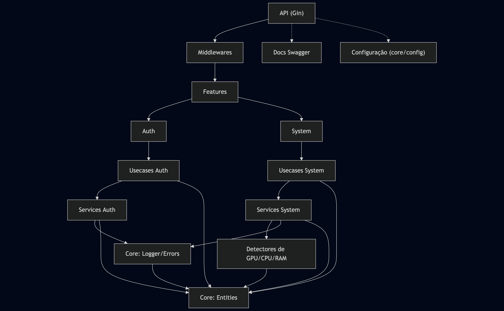

# spooliq

[](https://golang.org)
[](LICENSE)
[](https://github.com/RodolfoBonis/spooliq/actions/workflows/ci.yaml)
[](https://github.com/RodolfoBonis/spooliq/actions/workflows/release.yaml)
[](https://hub.docker.com/)
[](http://localhost:8000/docs/index.html)

## Overview

**spooliq** - SpoolIq calcula o preço real das suas impressões 3D: filamento multi-cor (g/m), energia (kWh + bandeira), desgaste, overhead e mão-de-obra. Gera pacotes (só impressão, ajustes, modelagem), exporta PDF/CSV e guarda materiais.

---

## Key Features

- **Authentication & Authorization:** JWT-based authentication with role-based access control
- **Redis Cache System:** TypeScript-like decorator caching with multiple strategies (time-based, user-specific, query-aware)
- **System Monitoring:** CPU, RAM, GPU monitoring and system information
- **Health Checks:** Built-in health check endpoints
- **Logging:** Structured logging with Zap
- **Error Handling:** Centralized error handling with custom error types
- **Middleware Support:** CORS, authentication, monitoring, caching middleware
- **Infrastructure Ready:** Complete Docker Compose setup with PostgreSQL, Redis, RabbitMQ, and Keycloak
- **Ultra-Optimized Docker:** Scratch-based image with UPX compression (~500KB-1MB final size)
- **API Documentation:** Auto-generated Swagger/OpenAPI documentation
- **Dependency Injection:** Using Uber FX for dependency management

---

## Main Endpoints (Examples)

| Endpoint                        | Description                                    |
|----------------------------------|------------------------------------------------|
| `POST /api/v1/auth/login`       | User authentication                            |
| `POST /api/v1/auth/refresh`     | Refresh JWT token                              |
| `POST /api/v1/auth/logout`      | User logout                                    |
| `GET /api/v1/system/status`     | System status and information                  |
| `GET /health`                   | Health check endpoint                          |
| `GET /docs/index.html`          | Swagger API documentation                      |

---

## General Requirements

- **Go 1.23+**
- **Docker** (optional, for containerized environment)
- **PostgreSQL** (for data persistence)
- **Redis** (for caching functionality)
- **RabbitMQ** (for message queuing)
- **Keycloak** (for authentication services)

*Note: All external dependencies are included in the Docker Compose setup for easy deployment.*

---

## Directory Structure

```
spooliq/
├── app/                # Main initialization and configuration
├── core/               # Central layer: logger, errors, middlewares, config
│   ├── config/         # Application configuration
│   ├── entities/       # Core entities and types
│   ├── errors/         # Error handling
│   ├── logger/         # Logging utilities
│   ├── middlewares/    # HTTP middlewares
│   ├── roles/          # Role definitions
│   ├── services/       # Core services
│   └── types/          # Custom types
├── features/           # Business domain features
│   ├── auth/           # Authentication and authorization
│   ├── system/         # System monitoring and information
│   └── ...             # Other business modules
├── routes/             # API route definitions
├── docs/               # Swagger/OpenAPI documentation
├── app_docs/           # Application documentation and guides
├── dockerfile          # Dockerfile for building the application
├── docker-compose.yaml # Service orchestration
├── go.mod / go.sum     # Go dependencies
└── README.md           # This file
```

---

## Application Architecture

   

---

## 📚 Documentation

Explore the complete documentation for advanced features and implementation details:

### 🔧 Core Features
- **[Cache System](app_docs/cache.md)** - Comprehensive caching implementation with Redis
- **[Cache Examples](app_docs/cache-examples.md)** - Practical examples and use cases
- **[User-Specific Caching](app_docs/cache-user-specific.md)** - Per-user cache isolation strategies
- **[API Key Authentication](app_docs/api-key-authentication.md)** - Alternative authentication using API keys

### 🐳 Deployment
- **[Docker with Private Repos](app_docs/docker-private-repos.md)** - Building with private GitHub dependencies

### 🔗 API Documentation
- **[Swagger UI](http://localhost:8000/docs/index.html)** - Interactive API documentation (when running)
- **[OpenAPI Spec](docs/swagger.yaml)** - Raw OpenAPI/Swagger specification

### 🏗️ Architecture
- **[System Architecture](app_docs/arquitetura.png)** - Visual overview of the application structure

*All documentation files are located in the `app_docs/` directory for easy access and maintenance.*

---

## Quick Start

### 1. Clone the repository
```bash
git clone https://github.com/RodolfoBonis/spooliq.git
cd spooliq
```

### 2. Set up environment variables
```bash
cp .env.example .env
# Edit .env with your configuration
```

### 3. Run with Docker Compose
```bash
docker-compose up --build
```

### 4. Run locally
```bash
# Install dependencies
go mod download

# Run the application
go run main.go
```

The API will be available at `http://localhost:8000`

---

## Endpoint Usage Examples

### Authentication
```bash
# Login
curl -X POST http://localhost:8000/api/v1/auth/login \
  -H "Content-Type: application/json" \
  -d '{"username": "user", "password": "password"}'

# Refresh token
curl -X POST http://localhost:8000/api/v1/auth/refresh \
  -H "Authorization: Bearer YOUR_TOKEN"
```

### System Information
```bash
# Get system status
curl http://localhost:8000/api/v1/system/status
```

### Health Check
```bash
curl http://localhost:8000/health
```

---

## Development

This project uses a `Makefile` to streamline common development tasks.

### Prerequisites

- **Go 1.23+**
- **Docker** (optional, for containerized environment)
- **Makefile** support (standard on Linux/macOS, may require installation on Windows)

### Available Commands

- **Run the application:**
  ```bash
  make run
  ```

- **Build the binary:**
  ```bash
  make build
  ```

- **Run tests:**
  ```bash
  make test
  ```

- **Run linters:**
  ```bash
  make lint
  ```

- **Clean build artifacts:**
  ```bash
  make clean
  ```

- **Display all commands:**
  ```bash
  make help
  ```

### Infrastructure Management

- **Start all services (PostgreSQL, Redis, RabbitMQ, Keycloak):**
  ```bash
  make infrastructure/raise
  ```

- **Stop all services:**
  ```bash
  make infrastructure/down
  ```

### Cache Management

- **Test cache functionality:**
  ```bash
  make cache/test
  ```

- **Check cache status:**
  ```bash
  make cache/status
  ```

- **Clear all cache:**
  ```bash
  make cache/clear
  ```

### Swagger Documentation

This project includes automatic Swagger documentation generation:

- **Auto-generated on every commit:** Documentation is automatically updated via pre-commit hooks
- **Manual generation:**
  ```bash
  bash scripts/generate-swagger.sh
  ```

- **Setup Git hooks (for new repositories):**
  ```bash
  bash scripts/setup-git-hooks.sh
  ```

- **Access documentation:** `http://localhost:8080/v1/docs/`

**Swagger annotations are automatically detected in:**
- Route handlers (`@Summary`, `@Description`, etc.)
- Request/Response structs (`@Success`, `@Failure`) 
- Error types and entities

### Running with Docker

To run the application and its services in a containerized environment:

1. **Configure environment variables:**
   - Copy `.env.example` to `.env` and customize the values.
   - **Important**: Set your `GITHUB_TOKEN` for private repository access.

2. **Build and start the services:**
   ```bash
   docker-compose up --build
   ```

**Note**: This project uses private GitHub repositories. See [Docker with Private Repos](app_docs/docker-private-repos.md) for detailed setup instructions.

---

## Environment Variable Configuration

Example of `.env`:
```
PORT=8000
DB_HOST=localhost
DB_PORT=5432
DB_USER=user
DB_SECRET=password
DB_NAME=spooliq_db
ENV=development
CLIENT_ID=your_client_id
CLIENT_SECRET=your_client_secret
REALM=your_realm
KEYCLOAK_HOST=your_keycloak_host
```

---

## API Documentation

Once the application is running, you can access the interactive API documentation at:
- **Swagger UI:** http://localhost:8000/docs/index.html

---

## Contributing

1. Fork the repository
2. Create your feature branch (`git checkout -b feature/amazing-feature`)
3. Commit your changes (`git commit -m 'Add some amazing feature'`)
4. Push to the branch (`git push origin feature/amazing-feature`)
5. Open a Pull Request

---

## License

This project is under the MIT license.  
See the [LICENSE](LICENSE) file for more details.

---

## Contact

- **Author:** RodolfoBonis
- **Repository:** https://github.com/RodolfoBonis/spooliq
