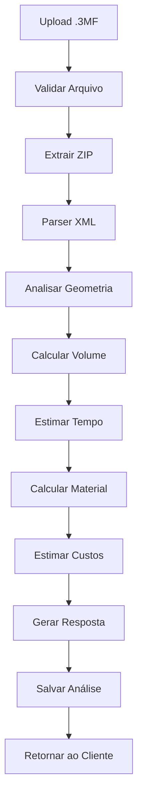

# 📦 Análise Automática de Arquivos .3MF - Especificação Técnica

## 📋 Visão Geral

Sistema para análise automática de arquivos .3MF (3D Manufacturing Format) que extrai informações críticas de manufatura como tempo de impressão, consumo de filamento, custos e configurações de forma automática.

## 🎯 Objetivos

### Primários
- Extrair automaticamente tempo de impressão estimado de arquivos .3MF
- Calcular gasto de filamento (peso em gramas e comprimento em metros)
- Estimar custos de produção baseado nos dados extraídos
- Integrar com o sistema de quotes existente

### Secundários
- Validar configurações de impressão
- Sugerir otimizações baseadas no perfil da máquina
- Criar histórico de análises para melhorar precisão futura
- Comparar estimativas vs. resultados reais

## 🏗️ Arquitetura Proposta

```
features/
├── file-analysis/
│   ├── domain/
│   │   ├── entities/
│   │   │   ├── analysis_entity.go         # Entidade de análise
│   │   │   └── file_metadata_entity.go    # Metadados do arquivo
│   │   ├── services/
│   │   │   └── analysis_service.go        # Interface do serviço
│   │   └── repositories/
│   │       └── analysis_repository.go     # Interface do repositório
│   ├── data/
│   │   ├── parser/
│   │   │   ├── threemf_parser.go         # Parser principal .3MF
│   │   │   ├── geometry_analyzer.go      # Análise de geometria
│   │   │   └── metadata_extractor.go     # Extrator de metadados
│   │   ├── services/
│   │   │   └── analysis_service_impl.go  # Implementação do serviço
│   │   └── repositories/
│   │       └── analysis_repository_impl.go # Implementação do repositório
│   ├── presentation/
│   │   ├── handlers/
│   │   │   └── analysis_handler.go       # Handlers HTTP
│   │   └── dto/
│   │       └── analysis_dto.go           # DTOs de request/response
│   └── di/
│       └── file_analysis_di.go           # Configuração de DI
```

## 📊 Estrutura de Dados

### Entidade de Análise
```go
type FileAnalysis struct {
    ID              uint
    FileHash        string              // SHA256 do arquivo
    FileName        string
    FileSize        int64

    // Dados extraídos
    ModelVolume     float64             // cm³
    BoundingBox     BoundingBox
    LayerHeight     float64             // mm
    PrintTime       int                 // segundos
    FilamentWeight  float64             // gramas
    FilamentLength  float64             // metros

    // Configurações detectadas
    PrintSpeed      float64             // mm/s
    NozzleTemp      float64             // °C
    BedTemp         float64             // °C
    InfillPercent   float64             // %
    SupportEnabled  bool

    // Metadados
    SlicerSoftware  string
    SlicerVersion   string
    PrinterModel    string

    // Relacionamentos
    OwnerUserID     string
    QuoteID         *uint               // Link para quote se criado
    CreatedAt       time.Time

    // Multi-Color Support (NEW)
    MultiColor      *MultiColorAnalysis // Análise multi-cor se aplicável
}

// NEW: Estruturas para suporte Multi-Cor
type MultiColorAnalysis struct {
    Enabled         bool                // Se é impressão multi-cor
    TotalColors     int                 // Número de cores detectadas
    ColorMaterials  []ColorMaterial     // Lista de materiais/cores
    ColorMapping    map[int]int         // Mapeamento objeto->cor
    RequiresAMS     bool                // Se precisa de sistema multi-material
    FilamentChanges int                 // Número de trocas de filamento
    PurgeVolume     float64             // Volume de purge estimado (cm³)
}

type ColorMaterial struct {
    Index           int                 // Índice do material no arquivo
    Name            string              // Nome do material (ex: "PLA Vermelho")
    Type            string              // Tipo (PLA, PETG, ABS)
    DisplayColor    string              // Cor em hexadecimal #RRGGBB
    Weight          float64             // Peso estimado deste material (g)
    Volume          float64             // Volume deste material (cm³)
    Length          float64             // Comprimento estimado (m)
    Percentage      float64             // Percentual do total
    SuggestedFilamentID *uint           // ID do filamento sugerido do catálogo
}
```

### DTO de Resposta
```go
type AnalysisResponse struct {
    ID             uint                    `json:"id"`
    FileName       string                  `json:"file_name"`
    Status         string                  `json:"status"`

    // Resultados da análise
    PrintTime      PrintTimeEstimate       `json:"print_time"`
    FilamentUsage  FilamentUsageEstimate   `json:"filament_usage"`
    CostEstimate   CostBreakdown          `json:"cost_estimate"`

    // Configurações recomendadas
    Recommendations []Recommendation       `json:"recommendations"`

    // Multi-Color Analysis (NEW)
    MultiColor      *MultiColorResponse    `json:"multi_color,omitempty"`
}

// NEW: Response para análise multi-cor
type MultiColorResponse struct {
    Enabled         bool                   `json:"enabled"`
    TotalColors     int                    `json:"total_colors"`
    Materials       []ColorMaterialResponse `json:"materials"`
    RequiresAMS     bool                   `json:"requires_ams"`
    FilamentChanges int                    `json:"filament_changes"`
    PurgeEstimate   PurgeEstimate          `json:"purge_estimate"`
}

type ColorMaterialResponse struct {
    Index           int                    `json:"index"`
    Name            string                 `json:"name"`
    Type            string                 `json:"type"`
    Color           string                 `json:"color"`
    ColorName       string                 `json:"color_name,omitempty"`
    WeightGrams     float64                `json:"weight_grams"`
    LengthMeters    float64                `json:"length_meters"`
    Percentage      float64                `json:"percentage"`
    Cost            float64                `json:"cost"`
    SuggestedFilament *FilamentSuggestion  `json:"suggested_filament,omitempty"`
}

type FilamentSuggestion struct {
    ID              uint                   `json:"id"`
    Name            string                 `json:"name"`
    ColorMatch      float64                `json:"color_match_percentage"`
    Available       bool                   `json:"available"`
}

type PurgeEstimate struct {
    VolumeCC        float64                `json:"volume_cc"`
    WeightGrams     float64                `json:"weight_grams"`
    WastePercentage float64                `json:"waste_percentage"`
}

type PrintTimeEstimate struct {
    Hours          int                     `json:"hours"`
    Minutes        int                     `json:"minutes"`
    Seconds        int                     `json:"seconds"`
    TotalSeconds   int                     `json:"total_seconds"`
}

type FilamentUsageEstimate struct {
    WeightGrams    float64                 `json:"weight_grams"`
    LengthMeters   float64                 `json:"length_meters"`
    VolumeCC       float64                 `json:"volume_cc"`
}

type CostBreakdown struct {
    MaterialCost   float64                 `json:"material_cost"`
    EnergyCost     float64                 `json:"energy_cost"`
    MachineCost    float64                 `json:"machine_cost"`
    TotalCost      float64                 `json:"total_cost"`
}
```

## 🔧 Detalhes de Implementação

### 1. Parser de Arquivos .3MF

O arquivo .3MF é essencialmente um arquivo ZIP contendo:
- **3dmodel.model**: XML com geometria e metadados
- **Metadata/**: Configurações de impressão e thumbnails
- **[Content_Types].xml**: Tipos de conteúdo
- **_rels/**: Relacionamentos entre arquivos

```go
func Parse3MFFile(file io.Reader) (*ThreeMFData, error) {
    // 1. Descompactar arquivo ZIP
    // 2. Localizar e parsear 3dmodel.model
    // 3. Extrair metadados de impressão
    // 4. Calcular volume e dimensões
    // 5. Estimar tempo e material
    // 6. NEW: Extrair informações de multi-cor
}
```

### 2. Parser de Multi-Cor (NEW)

```go
type MultiColorParser interface {
    // Extrai materiais base do XML
    ExtractBaseMaterials(xmlData []byte) ([]BaseMaterial, error)

    // Mapeia triângulos para cores
    MapTrianglesToColors(model *Model3D) map[int]int

    // Calcula volume por cor
    CalculateVolumePerColor(model *Model3D, colorMap map[int]int) map[int]float64

    // Identifica filamentos correspondentes no catálogo
    MatchFilamentsFromCatalog(materials []BaseMaterial, catalog []Filament) []FilamentMatch
}

// Estrutura de material base do .3MF
type BaseMaterial struct {
    ID          int
    Name        string
    DisplayColor string  // #RRGGBB
    Type        string   // PLA, PETG, etc
}

// XML parsing para basematerials
func ParseBaseMaterials(xmlContent []byte) ([]BaseMaterial, error) {
    // Parse XML namespace: http://schemas.microsoft.com/3dmanufacturing/material/2015/02
    // Extrair <basematerials> com atributos name e displaycolor
}
```

### 3. Análise de Geometria

```go
type GeometryAnalyzer interface {
    CalculateVolume(vertices []Vertex, triangles []Triangle) float64
    CalculateBoundingBox(vertices []Vertex) BoundingBox
    EstimateSupportVolume(model *Model, angle float64) float64
    AnalyzeComplexity(model *Model) ComplexityScore
}
```

### 4. Estimadores

```go
type PrintTimeEstimator interface {
    EstimateTime(volume float64, layerHeight float64, speed float64) int
    // NEW: Estimar tempo adicional para trocas de cor
    EstimateColorChangeTime(changes int, purgeVolume float64) int
}

type FilamentEstimator interface {
    EstimateWeight(volume float64, density float64, infill float64) float64
    EstimateLength(weight float64, diameter float64, density float64) float64
    // NEW: Estimar desperdício de purge
    EstimatePurgeWaste(colorChanges int, nozzleDiameter float64) float64
}

// NEW: Matching de cores
type ColorMatcher interface {
    // Calcula distância entre cores (0-100%)
    CalculateColorDistance(hex1, hex2 string) float64

    // Encontra melhor match no catálogo
    FindBestColorMatch(targetColor string, availableFilaments []Filament) *Filament

    // Converte cor hex para nome legível
    GetColorName(hexColor string) string
}
```

## 🚀 API Endpoints

### POST /v1/files/analyze
Upload e análise de arquivo .3MF

**Request:**
```http
POST /v1/files/analyze
Content-Type: multipart/form-data

file: [binary .3mf file]
filament_id: 123 (optional)
machine_profile_id: 456 (optional)
```

**Response:**
```json
{
  "analysis_id": "uuid",
  "status": "processing",
  "estimated_completion": "2024-01-10T10:00:00Z"
}
```

### GET /v1/files/analysis/{id}
Recuperar resultados da análise

**Response:**
```json
{
  "id": "uuid",
  "file_name": "model.3mf",
  "status": "completed",
  "print_time": {
    "hours": 3,
    "minutes": 45,
    "seconds": 30,
    "total_seconds": 13530
  },
  "filament_usage": {
    "weight_grams": 125.5,
    "length_meters": 42.3,
    "volume_cc": 100.4
  },
  "cost_estimate": {
    "material_cost": 15.68,
    "energy_cost": 2.34,
    "machine_cost": 5.00,
    "total_cost": 23.02
  },
  "recommendations": [
    {
      "type": "optimization",
      "message": "Consider 0.2mm layer height for better quality",
      "impact": "Increases print time by 20%"
    }
  ],
  "multi_color": {
    "enabled": true,
    "total_colors": 3,
    "materials": [
      {
        "index": 0,
        "name": "PLA Vermelho",
        "type": "PLA",
        "color": "#FF0000",
        "color_name": "Red",
        "weight_grams": 45.2,
        "length_meters": 15.3,
        "percentage": 36.0,
        "cost": 5.65,
        "suggested_filament": {
          "id": 123,
          "name": "SUNLU PLA Vermelho",
          "color_match_percentage": 98.5,
          "available": true
        }
      },
      {
        "index": 1,
        "name": "PLA Azul",
        "type": "PLA",
        "color": "#0000FF",
        "color_name": "Blue",
        "weight_grams": 32.1,
        "length_meters": 10.8,
        "percentage": 25.6,
        "cost": 4.01,
        "suggested_filament": {
          "id": 124,
          "name": "SUNLU PLA Azul",
          "color_match_percentage": 95.2,
          "available": true
        }
      },
      {
        "index": 2,
        "name": "PLA Branco",
        "type": "PLA",
        "color": "#FFFFFF",
        "color_name": "White",
        "weight_grams": 48.2,
        "length_meters": 16.3,
        "percentage": 38.4,
        "cost": 6.03,
        "suggested_filament": {
          "id": 125,
          "name": "SUNLU PLA Branco",
          "color_match_percentage": 100.0,
          "available": true
        }
      }
    ],
    "requires_ams": true,
    "filament_changes": 87,
    "purge_estimate": {
      "volume_cc": 12.5,
      "weight_grams": 15.6,
      "waste_percentage": 11.1
    }
  }
}
```

### POST /v1/files/analysis/{id}/create-quote
Converter análise em quote

**Request:**
```json
{
  "title": "Quote from 3MF analysis",
  "notes": "Auto-generated from file analysis",
  "filament_id": 123,
  "machine_profile_id": 456
}
```

**Response:**
```json
{
  "quote_id": 789,
  "title": "Quote from 3MF analysis",
  "total_cost": 23.02,
  "print_time": 13530,
  "filament_weight": 125.5
}
```

## 🔗 Integração com Sistema Existente

### 1. Catálogo de Filamentos
- Usar `FilamentRepository` existente para buscar propriedades do material
- Densidade do material para cálculos de peso/volume
- Preço por kg para estimativa de custo

### 2. Perfis de Máquina
- Integrar com `MachineProfile` para velocidades de impressão
- Usar configurações de energia e depreciação
- Validar compatibilidade de material com máquina

### 3. Sistema de Quotes
- Criar método `CreateQuoteFromAnalysis()`
- Reusar lógica de cálculo existente
- Manter histórico de análise → quote

## 📦 Bibliotecas Necessárias

### Go Nativo
- `archive/zip`: Descompactar arquivos .3MF
- `encoding/xml`: Parser de XML para metadados
- `crypto/sha256`: Hash de arquivos para deduplicação

### Bibliotecas Externas Sugeridas
```go
// go.mod additions
require (
    github.com/hschendel/stl v1.0.4  // Parser STL se necessário
    github.com/fogleman/fauxgl v0.0.0 // Geometria 3D
)
```

## 📈 Fluxo de Processamento



## 🎮 Casos de Uso

### Caso 1: Upload Simples
1. Usuário faz upload de arquivo .3MF
2. Sistema analisa automaticamente
3. Retorna estimativas em segundos
4. Usuário visualiza resultados

### Caso 2: Conversão para Quote
1. Usuário faz upload e análise
2. Seleciona filamento específico
3. Escolhe perfil de máquina
4. Sistema cria quote automático
5. Usuário pode ajustar e salvar

### Caso 3: Análise em Lote
1. Upload de múltiplos arquivos
2. Análise paralela
3. Comparação de resultados
4. Otimização de produção

## 🔒 Considerações de Segurança

- **Validação de Arquivo**: Verificar tipo MIME e estrutura
- **Limite de Tamanho**: Max 100MB por arquivo
- **Rate Limiting**: Max 10 análises por minuto por usuário
- **Sanitização**: Limpar metadados antes de armazenar
- **Isolamento**: Processar em ambiente sandboxed

## 📊 Métricas de Sucesso

- **Precisão**: ±10% do tempo real de impressão
- **Performance**: Análise em <5 segundos para arquivos <50MB
- **Adoção**: 50% dos quotes criados via análise automática
- **Satisfação**: Redução de 70% no tempo de criação de quotes

## 🚧 Implementação Faseada

### Fase 1: MVP (2 semanas)
- Parser básico de .3MF
- Extração de volume e tempo
- API de upload e análise
- Integração básica com quotes

### Fase 2: Melhorias (2 semanas)
- Análise avançada de geometria
- Cálculo de suporte
- Otimizações de performance
- UI para visualização

### Fase 3: Inteligência (3 semanas)
- Machine Learning para precisão
- Análise de histórico
- Recomendações automáticas
- Dashboard de métricas

## 🔍 Referências Técnicas

- [3MF Specification](https://github.com/3MFConsortium/spec_core)
- [ISO/IEC 25422:2025](https://www.iso.org/standard/82985.html)
- [Open Packaging Conventions](https://www.ecma-international.org/publications-and-standards/standards/ecma-376/)
- [Prusa 3MF Implementation](https://github.com/prusa3d/PrusaSlicer)

## 📝 Notas de Implementação

1. **Compatibilidade**: Suportar variações de .3MF (Prusa, Bambu, Cura)
2. **Cache**: Armazenar análises por hash do arquivo
3. **Async**: Processar análises em background para arquivos grandes
4. **Fallback**: Se não houver G-code, estimar baseado em geometria
5. **Extensibilidade**: Preparar para outros formatos (STL, OBJ, STEP)

---

*Documento criado em: 2024-01-22*
*Autor: Sistema Spooliq*
*Status: Especificação para implementação futura*