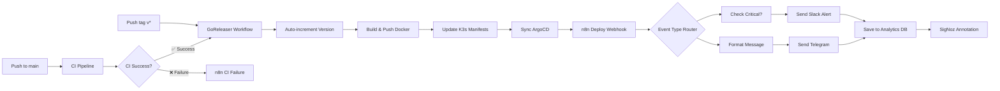

# n8n Setup para CI/CD Notifications

## 🚀 Configuração Completa

### 1. Preparar Banco de Analytics

```bash
# Iniciar banco de analytics separado
make analytics/start

# Verificar se está rodando
make analytics/status

# (Opcional) Iniciar ferramentas visuais
make analytics/tools
# pgAdmin: http://localhost:5050
# Grafana: http://localhost:3001
```

### 2. Configurar n8n

#### 2.1. Importar Workflow
1. Abra o n8n em sua instância
2. Vá em **Workflows** > **Import from File**
3. Selecione o arquivo `ci-cd-notifications-workflow.json`
4. Ative o workflow

#### 2.2. Configurar Credenciais

**PostgreSQL Analytics Database:**
```
Host: localhost (ou IP do servidor)
Port: 5433
Database: spooliq_analytics
Username: analytics_user  
Password: analytics_pass_2024
SSL Mode: disable (para desenvolvimento local)
```

**Telegram Bot:**
```
Bot Token: SEU_BOT_TOKEN_DO_TELEGRAM
```

**Slack (Opcional):**
```
Token: SEU_SLACK_BOT_TOKEN
```

**SigNoz (Opcional):**
```
API Key: SEU_SIGNOZ_API_KEY
Base URL: https://api.signoz.io
```

### 3. Configurar GitHub Secrets

No seu repositório GitHub, adicione os seguintes secrets:

```bash
# n8n Webhook
N8N_WEBHOOK_URL=https://your-n8n-instance.com/webhook/spooliq-ci-cd
N8N_API_TOKEN=your-optional-api-token

# Telegram (existentes)
CHAT_ID=-123456789
THREAD_ID=42

# Outros secrets existentes
BOTTOKEN=...
AWS_ACCESS_KEY_ID=...
# etc.
```

### 4. Testar Configuração

#### 4.1. Teste Manual do Webhook

```bash
# Teste com payload de sucesso
curl -X POST "https://your-n8n-instance.com/webhook/spooliq-ci-cd" \
  -H "Content-Type: application/json" \
  -H "Authorization: Bearer your-api-token" \
  -d '{
    "event_type": "deploy_success",
    "repository": "RodolfoBonis/spooliq",
    "workflow": "Test Workflow",
    "commit_sha": "abc123",
    "tag": "v1.0.0",
    "branch": "refs/heads/main",
    "actor": "testuser",
    "timestamp": "2024-01-15T10:30:00Z",
    "details": {
      "docker_image": "test/spooliq:1.0.0",
      "argocd_sync": "success",
      "build_time": "2m 30s"
    },
    "telegram_chat_id": "-123456789",
    "telegram_thread_id": "42"
  }'
```

#### 4.2. Verificar Dados no Banco

```bash
# Conectar ao banco
make analytics/query

# Verificar registros
SELECT * FROM deployment_history ORDER BY timestamp DESC LIMIT 5;

# Verificar estatísticas
SELECT 
  event_type,
  status,
  COUNT(*) as count
FROM deployment_history 
GROUP BY event_type, status;
```

### 5. Fluxo Simplificado (Apenas GoReleaser)

**Novo Workflow com Dependência de CI:**
- ✅ Push para `main` → CI → ✅ CI Success → GoReleaser (auto-increment) → Deploy
- ✅ Push de tag `v*` → GoReleaser → Deploy (direto)



**Comandos Úteis:**
```bash
# Trigger automático (push para main)
make release-auto

# Release manual com tag
make release-tag
make release-push
```

## 🔧 Troubleshooting

### Webhook não recebe dados
1. Verifique se o n8n está acessível publicamente
2. Confirme a URL do webhook no GitHub Secrets
3. Verifique logs do n8n

### Erro de conexão com PostgreSQL
1. Confirme se o banco analytics está rodando: `make analytics/status`
2. Verifique as credenciais no n8n
3. Teste conexão: `make analytics/query`

### Telegram não recebe mensagens
1. Verifique o Bot Token nas credenciais do n8n
2. Confirme se o bot está no grupo/canal correto
3. Verifique se o Chat ID está correto

### Dados não aparecem no banco
1. Execute as migrações: `make analytics/migrate`
2. Verifique se a tabela existe: `make analytics/query`
3. Confirme se o workflow está ativo no n8n

## 📊 Queries Úteis

### Top 10 deployments recentes
```sql
SELECT 
  repository,
  event_type,
  status,
  actor,
  timestamp
FROM deployment_history 
ORDER BY timestamp DESC 
LIMIT 10;
```

### Success rate por repositório
```sql
SELECT 
  repository,
  COUNT(*) as total,
  COUNT(CASE WHEN status = 'success' THEN 1 END) as successful,
  ROUND(
    COUNT(CASE WHEN status = 'success' THEN 1 END) * 100.0 / COUNT(*), 
    2
  ) as success_rate
FROM deployment_history 
WHERE timestamp >= NOW() - INTERVAL '7 days'
GROUP BY repository;
```

### Falhas mais comuns
```sql
SELECT 
  LEFT(error_message, 100) as error_summary,
  COUNT(*) as occurrences
FROM deployment_history 
WHERE status = 'failure' 
  AND error_message IS NOT NULL
GROUP BY LEFT(error_message, 100)
ORDER BY occurrences DESC
LIMIT 5;
```

## 🛠️ Comandos Úteis

```bash
# Gerenciamento do banco de analytics
make analytics/start      # Iniciar banco
make analytics/stop       # Parar banco  
make analytics/migrate    # Executar migrações
make analytics/query      # Conectar via psql
make analytics/status     # Ver estatísticas
make analytics/tools      # Iniciar pgAdmin + Grafana
make analytics/clean      # Limpar todos os dados

# Verificar logs
make analytics/logs

# Ver estrutura da tabela
make analytics/query
\d deployment_history
```

## 🔐 Segurança

1. **Use HTTPS** para o webhook do n8n
2. **Configure autenticação** com N8N_API_TOKEN
3. **Restinja acesso** ao banco analytics (apenas n8n)
4. **Rotacione tokens** regularmente
5. **Configure backups** do banco analytics

## 📈 Monitoramento

- **pgAdmin**: Interface visual para gerenciar o banco
- **Grafana**: Dashboards com métricas de deployment
- **n8n logs**: Monitorar execução dos workflows
- **GitHub Actions**: Ver status dos webhooks